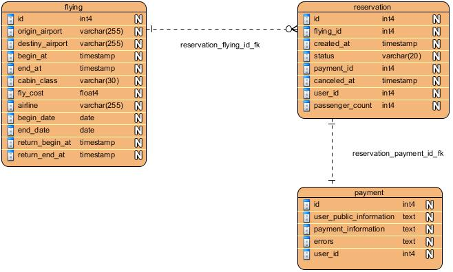

# Challenger Application

## Introdution

The Booking component must contain a search form with destination, origin, start date, end date, cabin class, among others. This information from the search form must be loaded from a defined list that can be saved in a DB or in a file, since this information does not change frequently, I recommend that everything that is static or almost static be saved in files.

In order to have information on scheduled flights, companies must enter the system and schedule said flights with the corresponding information, through another functionality.

When searching, all the necessary parameters must be sent to the server and the search for scheduled flights must be carried out. This information must be found in the DB or an API from a third party that provides said information can be consumed. The search result is shown in the list of flights organized and with all possible information: start time, end time, class, price, company, etc. The option that can be reserved (Book) is provided, a modal type form would be displayed to confirm the flight information, passenger data and payment data where the corresponding actions would be carried out in a series of steps. Once reserved, the necessary information is provided to the user of the flight reservation and it is saved in the history to follow up or allow the reservation to be cancelled.

The data load of the search form and the search for flights were coded, missing the booking of flights and paying for the reservation. For that, the model classes previously mapped with the tables in the database would be used, where the information would be recorded, previously the defined rules and validations would be applied.

## Tecnologies used

`Boostrap 5.3, Vuejs 2.5, CodeIgniter 4.x, Postgres, MVC.`

## Code Style

-	80 characters per line. - 4 spaces for indentation. - Classes are declared in StudlyCaps.
-	The methods and properties are declared in camelCase and have to carry visibility.
-	Constants are declared in uppercase and separated by underscope.
-	The methods and classes must be documented and the parameters of the methods must have the type declared, as well as the return of each method.
-	For strings that do not contain variables, use ''.
-	The declaration of array is with [].
-	Use elseif instead of else if.
-	Comparisons must always be strict and variables must not be assigned within a condition.
-	Etc.

## Security and Validation

-	The site must be in https.
-	You must create a virtual host and configure the framework that allows the hostname.
-	Configure the framework for content security policies.
-	Requests to load filter information must be done by GET.
-	Requests to save the reservation and search for flights are made by POST.
-	Check that the requests are of the AJAX type for the actions that carry them.
-	The information that is consulted or saved in the DB must be filtered and escaped before any SQL query.
-	It must be validated in the view and in the server.
-	The information that is saved must go through the validation rules defined in the framework for each field.
-	Mask the requests to the actions of each controller by defining new routes.
-	Etc.

## Database design

-	The design of the DB must have a balance between performance, volume of information and the 3rd normal form.
-	Each table must be analyzed separately and check the level of read and write operations, also check the growth over time.
-	Requests must always have filters and limits, so as not to stress the server.
-	Avoid queries to the DB within cycles.

## Backend
### Actions
For the implementation of the actions, the Home.php controller was used: `class Home extends BaseController {...}`.
All the parameters that receive the actions either by POST or GET must pass the defined validations and filters, to mention a few:
- Validate that the expected data type is correct.
- Validate that the size does not exceed the specified amount.
- Apply XSS filters.
- Apply model validations.
- Escape the parameters before they are used to generate an SQL query.

#### The main actions are described below:
- **airports:** Search for the airports near the user's location or a city. Receives a code and returns a list of up to 5 airports in json format.
- **searchflyings:** Lists scheduled flights from an origin airport to a destination in a given date range. For each flight, the Origin, Destination, Date and Time of departure, Date and Time of arrival, Number of people, Cabin Class and Price of the flight are shown. Receives Origin, Destination, Start Date, End Date and returns a list of up to 5 scheduled flights in json format.
- **bookFlight:** Make the reservation of a scheduled flight and flight ticket by email. It receives the identifier of the flight to be booked, the user's email address for sending the ticket and the details of the payment made, and returns a confirmation that the flight has been booked.
- **-payReservation:** Make the reservation payment, you must use the payment gateways defined by the different providers. Receives the user's name and surname, ID, payment method (Visa, MasterCard, Paypal, etc.), account number, confirmation pin and returns the confirmation of payment made or error in case of failure.
- **cancelReservation:** Cancels the scheduled flight reservation and returns 90% of the amount paid by the user. Receives the reservation identifier and returns the confirmation of the cancellation of the flight.
- **myReservations:** Lists the user's reservations, returns a list of the user's reservations in JSON format

### Database
#### Below is a description of the main tables used in the solution:

- **flying table:** It is used to save the flights scheduled by the flight agencies.
- **payment table:** It is used to save user payment data for each flight reservation
- **reservation table:** It is used to save the data of the user's reservation and his subsequent reservation history.



### Model
Each table must be represented as a model class where the attributes and validation rules for each attribute are defined. These classes must implement the information search in the tables and other rules associated with the business process.A model class called BaseModel will be created from which the defined models will inherit. In this class the common attributes and methods will be implemented.A model class called BaseModel will be created from which the defined models will inherit. In this class the common attributes and methods will be implemented.

####Main validations:

**FlyingModel**

- `'origin_airport' => 'required|alpha_numeric_space|min_length[3]|max_length[255]',`
- `'destiny_airport' => 'required|alpha_numeric_space|min_length[3]|max_length[255]',`
- `'begin_at' => 'required|valid_date',`
- `'end_at' => 'required|valid_date',`
- `'cabin_class' => 'required|alpha_numeric_space|min_length[3]|max_length[30]',`
- `'fly_coast' => 'required|numeric',`
- `'airline' => 'required|alpha_numeric_space|min_length[3]|max_length[255]',`
- `'begin_date' => 'required|valid_date',`
- `'end_date' => 'required|valid_date',`
- `'return_begin_at' => 'valid_date',`
- `'return_end_at' => 'valid_date',`

**ReservationModel**

- `'flying_id' => 'required|integer',`
- `'created_at' => 'required|valid_date',`
- `'status' => 'required|alpha_numeric_space|min_length[3]|max_length[20]',`
- `'payment_id' => 'required|integer',`
- `'canceled_at' => 'required|valid_date',`
- `'user_id' => 'required|integer',`
- `'passenger_count' => 'required|integer',`

**PaymentModel**

- `'user_public_information' => 'required|valid_json',`
- `'payment_information' => 'required|valid_json',`
- `'errors' => 'valid_json',`
- `'user_id' => 'required|integer',`

## Frontend

To show the interfaces, 3 js files will be used where each one will implement a component in VueJs, they are:
- **app.js** main component where the flight search, reservation history and additional information for flight promotions will be displayed.Contains the reservation component.
- **reservation.js** VueJs component that will be in charge of managing a reservation, a form will be displayed in modal form with the information of the selected flight, the user's information and will provide the option to make the payment. Contains the payment component.
- **payment.js** VueJs component that has the function of displaying a modal with a form to make the reservation payment, the user's bank details will be sent encrypted.
- **common_input.js** component that will handle and display a form component (text, date, description, list) depending on the configured parameters. It will contain the common validations for each input type and will be used in the other components that need a form, such as the Reservation component and the Payment component.

On the other hand, as an added value, the user will be given the option to work offline and once they are online, they will be able to synchronize with the server and send the information. For that, a database will be created in the browser and the services workers will be used to implement that feature. For this the library will be used:
- **dexie** for handling the browser's IndexedDB
- **dexie-encrypted** an addendum to perform encryption
- **core-js-bundle** dependency of the main library.
- **regenerator-runtime** dependency of the main library.
- **object-hash** to generate the hash for the IndexedDB encryption

## Local Deployment

For the publication of the site in the mentioned providers (Amazon EC2, Google AppEngine, IBM Cloud, etc) I could not complete the form to test the free service for a limited time because the credit card or debit card information was incorrect, since I don't have one.
I describe the steps to make a site publication on a server:

###Hosting with Apache

A webapp is normally hosted on a web server. Apache’s httpd is the “standard” platform, and assumed in much of our documentation.

Apache is bundled with many platforms, but can also be downloaded in a bundle with a database engine and PHP from Bitnami.

**.htaccess**

The “mod_rewrite” module enables URLs without “index.php” in them, and is assumed in our user guide.

Make sure that the rewrite module is enabled (uncommented) in the main configuration file, e.g., `apache2/conf/httpd.conf`

`LoadModule rewrite_module modules/mod_rewrite.so`

####Virtual Hosting

We recommend using “virtual hosting” to run your apps. You can set up different aliases for each of the apps you work on,

Add a host alias in your “hosts” file, typically /etc/hosts on unix-type platforms, or c:/Windows/System32/drivers/etc/hosts on Windows. Add a line to the file. This could be “challenge.local” or “challenge.test”, for instance: `127.0.0.1 challenge.local`
```
Listen 5000

<VirtualHost *:5000>
    DocumentRoot "/var/www/challenge/public"`
    ServerName challenge.local
    ServerAlias challenge.local
    <Directory "/var/www/challenge/public">
        Options All
        AllowOverride All
        Order deny,allow
        Allow from all
    </Directory>
</VirtualHost>
```
If your project folder is not a subfolder of the Apache document root, then your <VirtualHost> element may need a nested <Directory> element to grant the web server access to the files.


####Testing

With the above configuration, your webapp would be accessed with the URL http://challenge.local in your browser.

Apache needs to be restarted whenever you change its configuration.

####Also you must install [postgreSQL](https://www.postgresql.org/download/) and run the db.sql script.

###Hosting with Nginx

Nginx is the second most widely used HTTP server for web hosting. Here you can find an example configuration using PHP 7.3 FPM (unix sockets) under Ubuntu Server.

**default.conf**

This configuration enables URLs without “index.php” in them and using CodeIgniter’s “404 - File Not Found” for URLs ending with “.php”.

```
server {
    listen 80;
    listen [::]:80;

    server_name challenge.local;

    root  /var/www/challenge/public;
    index index.php index.html index.htm;

    location / {
        try_files $uri $uri/ /index.php$is_args$args;
    }

    location ~ \.php$ {
        include snippets/fastcgi-php.conf;

        # With php-fpm:
        fastcgi_pass unix:/run/php/php7.3-fpm.sock;
        # With php-cgi:
        # fastcgi_pass 127.0.0.1:9000;
    }

    error_page 404 /index.php;

    # deny access to hidden files such as .htaccess
    location ~ /\. {
        deny all;
    }
}
